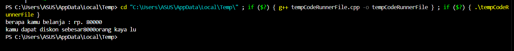
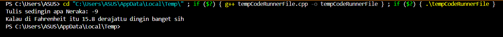
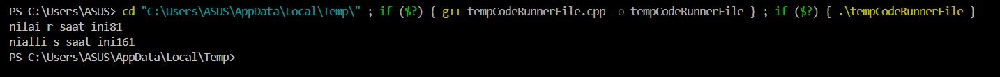
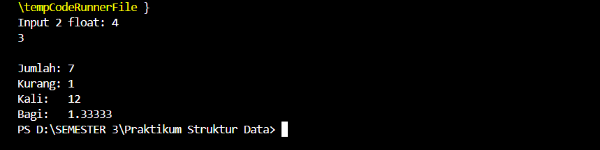
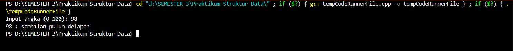
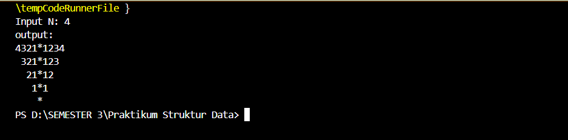

# Template Laporan Praktikum Struktur Data

## 1. Nama, NIM, Kelas
- **Nama**: Gustaf Adiyatma Al fito 
- **NIM**: 103112400266
- **Kelas**: IF - 12 - 05

## 2. Motivasi Belajar Struktur Data
Supaya Saya bisa Struktur Data

## 3. Dasar Teori
Struktur data adalah cara mengatur dan menyimpan data dalam komputer agar dapat diakses serta dikelola secara efisien. Secara umum, struktur data terbagi menjadi linier (array, linked list, stack, queue) dan non-linier (tree, graph), masing-masing dengan kelebihan dan kekurangannya. Operasi dasar yang dilakukan meliputi penyisipan, penghapusan, pencarian, pengurutan, dan penjelajahan data. Pemilihan struktur data yang tepat sangat penting karena berpengaruh langsung pada kinerja algoritma dan efisiensi program.

## 4. Guided
### 4.1 Guided 1

**-Code Program-**

```cpp
#include<iostream> // library untuk input/output

using namespace std; // biar bisa pakai cout & cin langsung

int main(){ // fungsi utama program
    double total_pembelian, diskon; // variabel untuk belanja & diskon
    cout<<"berapa kamu belanja : rp. "; // tampilkan teks
    cin>>total_pembelian; // input belanja

    if(total_pembelian > 30000){ // cek belanja > 30000 ?
        diskon = 0.1 * total_pembelian; // hitung diskon 10%
        cout<<"kamu dapat diskon sebesar " << diskon << " orang kaya lu"; // tampilkan diskon
    }else{ 
        cout<<"kamu belanjanya masih sedikit, tambahlah biar aku kaya "; // pesan jika < 30000
    }

    return 0; // akhir program
}
```

**-Penjelasan Umum-**
Program di atas meminta input total belanja dari pengguna, lalu memeriksa apakah belanja lebih dari 30.000. Jika iya, program menghitung diskon sebesar 10% dan menampilkannya, sedangkan jika tidak, program menampilkan pesan bahwa belanjanya masih sedikit. Program ini menggunakan library <iostream> untuk input/output, cin untuk membaca input, cout untuk menampilkan output, serta struktur if-else untuk pengambilan keputusan.

**-Output-**


### 4.2 Guided 2

**-Code Program-**
```cpp
#include <iostream> // library untuk input/output (cin & cout)

using namespace std; // supaya tidak perlu nulis std:: di depan cout/cin

int main() { // fungsi utama program
    float celsius, fahrenheit; // deklarasi variabel untuk suhu (Celsius & Fahrenheit)
    
    cout << "Tulis sedingin apa Neraka: "; // tampilkan teks untuk minta input
    cin >> celsius; // input suhu dalam Celsius dari user
    
    fahrenheit = (9.0 / 5.0) * celsius + 32; // rumus konversi Celsius → Fahrenheit
    
    cout << "Kalau di Fahrenheit itu " << fahrenheit << " derajat"; // tampilkan hasil konversi
    cout << "Lu dingin banget sih"; // tambahan teks setelah hasil
    
    return 0; // mengakhiri program dengan status sukses
}
```
**-Penjelasan Umum-**
Program ini berfungsi untuk mengonversi suhu dari Celsius ke Fahrenheit. Pertama, user diminta memasukkan suhu dalam Celsius, lalu program menghitung konversinya dengan rumus (9.0/5.0) * celsius + 32. Setelah itu, hasil konversi ditampilkan dalam satuan Fahrenheit beserta pesan tambahan yang sudah ditulis dalam cout.

**-Output-**



### 4.3 Guided 3
**-Code Program-**
```cpp
#include <iostream> // Menyertakan (include) library untuk output (cout).

using namespace std; // Memakai namespace standar (agar tidak perlu 'std::').

int main(){ // Awal program utama.

    int r=80; // 'r' diatur ke 80.
    int s; // 's' dideklarasikan.

    s=80 + ++r; // **Pre-increment**: 'r' naik menjadi **81** dulu. Kemudian 's' = 80 + 81, jadi 's' = **161**.

    cout<<"nilai r saat ini"<<r<<endl; // Cetak 'r' (**81**).
    cout<<"nialli s saat ini"<<s<<endl; // Cetak 's' (**161**).

    return 0; // Program selesai.

}
```

**-Penjelasan Umum-**
Program C++ ini mendeklarasikan variabel r dengan nilai awal 80 dan variabel s. Operasi kunci ada pada baris s=80 + ++r; yang menggunakan pre-increment (++r). Artinya, nilai r akan dinaikkan 1 terlebih dahulu (menjadi 81), baru kemudian digunakan dalam perhitungan. Jadi, s dihitung sebagai 80+81, yang menghasilkan 161. Akhirnya, program mencetak nilai r yang sekarang (81) dan nilai s (161).

**-Output-**


## 5. Unguided
### 5.1 Unguided 1

**-Code Program-**
```cpp
#include <iostream> // Pakai library Input/Output (I/O).
using namespace std; // Pakai nama standar (cout, cin).

int main() { // Awal program.
    float a, b; // Deklarasi dua angka desimal.
    cout << "Input 2 float: "; // Minta input.
    cin >> a >> b; // Terima input.

    cout << "\nJumlah: " << a + b << endl; // Cetak hasil tambah.
    cout << "Kurang: " << a - b << endl; // Cetak hasil kurang.
    cout << "Kali:   " << a * b << endl; // Cetak hasil kali.

    if (b != 0) { // Jika 'b' bukan nol.
        cout << "Bagi:   " << a / b << endl; // Cetak hasil bagi.
    } else { // Jika 'b' adalah nol.
        cout << "Bagi:   Error (bagi nol)" << endl; // Cetak pesan error.
    }

    return 0; // Program selesai.
}
```

**-Penjelasan Umum-**
Program C++ ini bertujuan menghitung empat operasi aritmatika (tambah, kurang, kali, bagi) dari dua bilangan desimal (float), yaitu a dan b. Setelah menerima input kedua angka tersebut, program langsung mencetak hasil penjumlahan, pengurangan, dan perkalian. Untuk operasi pembagian, program menggunakan struktur if-else untuk memeriksa apakah pembagi (b) bernilai nol; jika b bukan nol, ia mencetak hasil pembagian a/b, tetapi jika b adalah nol, program akan mencetak pesan error karena pembagian oleh nol tidak diperbolehkan.

**-Output-**


### 5.2 Unguided 2
**-Code Program-**
```cpp
#include <iostream> // Pakai library Input/Output (I/O).
#include <string> // Pakai library untuk tipe data teks.
using namespace std; // Pakai nama standar (cout, cin, string).

string s(int n) { // Fungsi 's': Konversi angka satuan (1-9) ke teks.
    switch (n) { // Cek nilai n.
        case 1: return "satu"; case 9: return "sembilan"; // Contoh: Ubah 1 jadi "satu", dst.
        default: return ""; // Jika 0 atau lainnya, kembalikan teks kosong.
    }
}

string k(int a) { // Fungsi 'k': Fungsi utama, konversi angka 0-100 ke teks.
    if (a == 0) return "nol"; // Kasus khusus: nol.
    if (a == 100) return "seratus"; // Kasus khusus: seratus.
    if (a >= 10 && a <= 19) { // Jika angka 10 sampai 19 (belasan).
        if (a == 10) return "sepuluh"; // Kasus sepuluh.
        if (a == 11) return "sebelas"; // Kasus sebelas.
        // ... menangani kasus 12, 13, 15 secara khusus ...
        return s(a % 10) + " belas"; // Angka lain jadi [satuan] belas (misal: "empat belas").
    }
    if (a >= 20 && a <= 99) return s(a / 10) + " puluh " + s(a % 10); // Gabungan: [puluhan] puluh [satuan] (misal: "tujuh puluh sembilan").
    return s(a); // Jika 1-9, panggil fungsi satuan 's'.
}

int main() { // Fungsi utama program.
    int n; // Variabel angka input.
    cout << "Input angka (0-100): "; // Minta input.
    cin >> n; // Terima input.
    if (n < 0 || n > 100) { // Cek apakah angka di luar batas (0-100).
        cout << "Angka di luar batas." << endl; // Cetak pesan error batas.
    } else { // Jika angka valid.
        cout << n << " : " << k(n) << endl; // Cetak angka dan hasil konversi teks dari fungsi 'k'.
    }
    return 0; // Program selesai.
}
```

**-Penjelasan Umum-**
Program C++ ini berfungsi untuk mengonversi input angka bulat positif antara 0 hingga 100 menjadi bentuk tulisan (ejaan). Program menggunakan dua fungsi: fungsi pembantu s() untuk mengubah angka satuan (1-9) menjadi teks, dan fungsi utama k() yang menangani semua kasus mulai dari nol, seratus, belasan (10-19), hingga puluhan (20-99). Struktur if-else dan operator modulus (%) serta pembagian (/) digunakan di dalam fungsi k() untuk memecah angka puluhan dan menggabungkan teks satuan yang dihasilkan, sehingga program dapat mencetak hasil konversi dengan benar, misalnya mengubah 98 menjadi "sembilan puluh delapan".

**-Output-**



### 5.3 Unguided 3
**-Code Program-**
```cpp
#include <iostream> // Pakai I/O.
#include <string> // Pakai tipe data teks.
using namespace std; // Pakai nama standar.

int main() { // Awal program.
    int N; // Variabel ukuran pola.
    cout << "Input N: "; // Minta input N.
    cin >> N; // Terima N.
    cout << "output:" << endl; // Cetak label.

    for (int i = N; i >= 1; --i) { // Loop Baris: Dari N turun ke 1.
        for (int sp = 0; sp < N - i; ++sp) cout << " "; // Cetak **spasi** awal.
        for (int j = i; j >= 1; --j) cout << j; // Cetak angka **menurun** (kiri).
        cout << "*"; // Cetak **bintang** tengah.
        for (int k = 1; k <= i; ++k) cout << k; // Cetak angka **menaik** (kanan).
        cout << endl; // Pindah baris.
    }

    for (int sp = 0; sp < N; ++sp) cout << " "; // Spasi lagi.
    cout << "*" << endl; // Cetak **bintang terakhir**.

    return 0; // Program selesai.
}
```

**-Penjelasan Umum-**
Program C++ ini meminta input angka N untuk menentukan ukuran pola piramida angka dan bintang. Inti program menggunakan loop utama (for (int i = N; ...)) yang berulang dari N ke 1, menciptakan setiap baris pola yang semakin mengecil. Di dalam loop ini, program secara berurutan mencetak spasi (untuk membuat bentuk segitiga), angka menurun (sisi kiri), satu bintang di tengah, dan angka menaik (sisi kanan), lalu pindah baris. Setelah semua baris selesai, program menutup pola dengan mencetak satu bintang terakhir di posisi paling bawah.

**-Output-**


## 6. Kesimpulan
kesimpulannya saya dapat memahami sebagian awalan materi pemrograman mengggunakan bahasa c++ karena ini saya pertama kalinya mengenal bahasa c++

## 7. Referensi
1. https://www.programiz.com/cpp-programming/online-compiler/
2. https://www.onlinegdb.com/online_c++_compiler