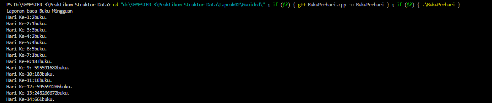
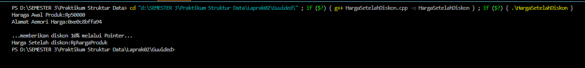
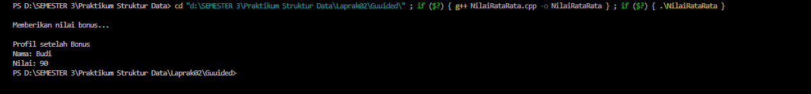
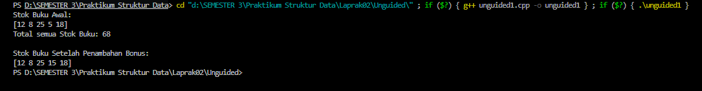

##  LAPRAK 02

## 1. Nama, NIM, Kelas
- **Nama**: Gustaf Adiyatma Al fito 
- **NIM**: 103112400266
- **Kelas**: IF - 12 - 05

## 2. Motivasi Belajar Struktur Data
Supaya Saya bisa Struktur Data

## 3. Dasar Teori
program ini mencakup konsep array, pointer, dan fungsi dalam bahasa C++. Array digunakan untuk menyimpan sekumpulan data dengan tipe yang sama, seperti data stok buku yang diakses menggunakan indeks. Pointer berfungsi untuk menyimpan alamat memori dari suatu variabel sehingga memungkinkan manipulasi data secara langsung di memori, seperti saat menambah stok melalui alamat elemen terkecil. Fungsi digunakan untuk membagi program menjadi bagian-bagian kecil yang memiliki tugas tertentu agar lebih terstruktur, misalnya fungsi untuk mencetak isi array, menghitung total stok, mencari stok paling sedikit, dan menambah bonus stok. Dengan menggabungkan array, pointer, dan fungsi, program dapat mengelola data secara efisien serta memodifikasi nilainya tanpa perlu menulis ulang kode di banyak tempat.

## 4. Guided
### 4.1 Guided 1

**-Code Program-**

```cpp
#include <iostream>       // Library untuk input dan output (cout, endl)
using namespace std;      // Agar tidak perlu menulis std:: di depan cout, endl, dll

int main() {
    int bukuPerHari[7] = {2, 1, 3, 2, 4, 5, 1}; // Array berisi jumlah buku yang dibaca tiap hari selama 7 hari
    int totalBuku = 0;                          // Variabel untuk menyimpan total buku yang dibaca

    cout << "Laporan Baca Buku Mingguan" << endl; // Menampilkan judul laporan

    // Looping dari hari ke-1 sampai ke-7
    for (int i = 0; i < 7; i++) {                // <-- diperbaiki dari 'i,7' menjadi 'i < 7'
        cout << "Hari ke-" << i + 1 << ": "      // Menampilkan nomor hari (i dimulai dari 0, jadi ditambah 1)
             << bukuPerHari[i] << " buku." << endl; // Menampilkan jumlah buku pada hari tersebut
        totalBuku += bukuPerHari[i];             // Menambahkan jumlah buku ke total
    }

    cout << "Total buku yang dibaca selama seminggu: " << totalBuku << " buku." << endl; 
    // Menampilkan total buku yang telah dibaca selama seminggu

    return 0; // Mengakhiri program dengan status sukses
}

```

**-Penjelasan Umum-**
Program ini digunakan untuk menampilkan laporan jumlah buku yang dibaca selama satu minggu.
Data jumlah buku per hari disimpan dalam sebuah array bernama bukuPerHari.
Kemudian, melalui perulangan for, program menampilkan jumlah buku yang dibaca setiap hari dan secara bersamaan menghitung total keseluruhan buku yang dibaca selama seminggu.Sambil jalan, juga nambahin semua total buku ke variabel totalBuku, biar di akhir bisa ditampilin totalnya.

**-Output-**



### 4.2 Guided 2

**-Code Program-**
```cpp
#include <iostream>           // Library untuk input-output (cout, endl)
using namespace std;          // Supaya tidak perlu nulis std:: setiap kali pakai cout

int main() {
    float hargaProduk = 50000.0f;   // Deklarasi variabel float dengan nilai awal 50000 (harga produk)

    float* ptrHarga;                // Deklarasi pointer bertipe float (penyimpan alamat variabel float)
    ptrHarga = &hargaProduk;        // Mengisi pointer dengan alamat dari variabel hargaProduk

    cout << "Harga Awal Produk: Rp" << hargaProduk << endl;   // Menampilkan harga awal produk
    cout << "Alamat Memori Harga: " << ptrHarga << endl;      // Menampilkan alamat memori dari variabel hargaProduk

    cout << "\n...Memberikan diskon 10% melalui Pointer..." << endl; // Menampilkan teks proses diskon

    *ptrHarga = *ptrHarga * 0.9;    // Mengubah nilai hargaProduk lewat pointer (diskon 10%)
    cout << "Harga Setelah Diskon: Rp" << hargaProduk << endl; // Menampilkan harga setelah didiskon

    return 0;  // Mengakhiri program dengan sukses
}

```
**-Penjelasan Umum-**
Program ini dipake untuk menampilkan harga produk dan memberikan diskon 10% menggunakan pointer.

**-Output-**


### 4.3 Guided 3

**-Code Program-**
```cpp
#include <iostream>     // Library untuk input-output (cout, endl)
#include <string>       // Library untuk tipe data string
using namespace std;    // Agar tidak perlu menulis std:: di depan cout, string, dll

// Fungsi untuk menghitung rata-rata nilai tugas dan UTS
float hitungRataRata(int nilaiTugas, int nilaiUTS) {
    return (nilaiTugas + nilaiUTS) / 2.0f;  // Mengembalikan nilai rata-rata dalam bentuk float
}

// Fungsi untuk menampilkan profil siswa
void cetakProfil(string nama, float nilai) {
    cout << "Nama: " << nama << endl;   // Menampilkan nama siswa
    cout << "Nilai: " << nilai << endl; // Menampilkan nilai akhir siswa
}

// Fungsi untuk memberikan nilai bonus (menggunakan referensi agar nilai aslinya berubah)
void beriNilaiBonus(float &nilai) {
    nilai += 5.0f;  // Menambah nilai sebesar 5 poin
}

int main() {
    string NamaSiswa = "Budi";  // Menyimpan nama siswa
    int tugas = 80, uts = 90;   // Nilai tugas dan nilai UTS

    float nilaiAkhir = hitungRataRata(tugas, uts); // Memanggil fungsi untuk menghitung rata-rata

    cout << "\nMemberikan nilai bonus..." << endl; // Menampilkan proses pemberian bonus
    beriNilaiBonus(nilaiAkhir);                    // Memanggil fungsi untuk menambah nilai bonus

    cout << "\nProfil setelah Bonus" << endl;      // Menampilkan hasil akhir setelah bonus
    cetakProfil(NamaSiswa, nilaiAkhir);            // Menampilkan nama dan nilai siswa setelah bonus

    return 0; // Mengakhiri program dengan sukses
}

```

**-Penjelasan Umum-**
Program ini dibuat untuk menghitung nilai akhir siswa, menambahkan bonus, dan menampilkan profilnya.
Pertama, program menghitung rata-rata dari nilai tugas dan UTS menggunakan fungsi hitungRataRata().
Kemudian, fungsi beriNilaiBonus() menambah 5 poin pada nilai akhir dengan memanfaatkan referensi (pass by reference) agar nilainya benar-benar berubah.

**-Output-**



## 5. Unguided
### 5.1 Unguided 1

**-Code Program-**
```cpp
#include <iostream>    // Library untuk input-output (cout, endl)
using namespace std;   // Supaya tidak perlu menulis std:: setiap kali pakai cout

// Fungsi untuk mencetak isi array stok buku
void cetakStok(int arr[], int size) {
    cout << "[";
    for (int i = 0; i < size; i++) {
        cout << arr[i];                  // Menampilkan elemen array ke layar
        if (i < size - 1) cout << " ";   // Memberi spasi antar elemen kecuali di akhir
    }
    cout << "]" << endl;                 // Tutup tanda kurung dan pindah baris
}

// Fungsi untuk menghitung total semua stok buku
int hitungTotalStok(int arr[], int size) {
    int total = 0;                       // Variabel untuk menampung total
    for (int i = 0; i < size; i++) {
        total += arr[i];                 // Menambahkan setiap elemen array ke total
    }
    return total;                        // Mengembalikan hasil total stok
}

// Fungsi untuk mencari stok buku paling sedikit (mengembalikan alamatnya)
int* cariStokPalingSedikit(int arr[], int size) {
    int* ptrPalingSedikit = &arr[0];     // Pointer menunjuk ke elemen pertama
    for (int i = 1; i < size; i++) {     // Periksa elemen berikutnya
        if (arr[i] < *ptrPalingSedikit) { // Jika stok lebih kecil dari stok terkecil saat ini
            ptrPalingSedikit = &arr[i];   // Ubah pointer agar menunjuk ke stok yang lebih sedikit
        }
    }
    return ptrPalingSedikit;              // Kembalikan pointer ke stok terkecil
}

// Fungsi untuk menambah stok sebesar 10 pada alamat yang ditunjuk pointer
void tambahStokBonus(int* ptrStok) {
    *ptrStok += 10;                      // Tambahkan 10 ke nilai stok melalui pointer
}

int main() {
    int stokBuku[] = {12, 8, 25, 5, 18};  // Array berisi stok tiap jenis buku
    int jumlahJenisBuku = 5;              // Banyaknya jenis buku

    cout << "Stok Buku Awal:" << endl;
    cetakStok(stokBuku, jumlahJenisBuku); // Menampilkan stok sebelum ada perubahan

    int total = hitungTotalStok(stokBuku, jumlahJenisBuku); // Hitung total semua stok
    cout << "Total semua Stok Buku: " << total << endl;

    int* ptrStokRendah = cariStokPalingSedikit(stokBuku, jumlahJenisBuku); // Cari stok paling sedikit
    tambahStokBonus(ptrStokRendah);                                        // Tambahkan stok bonus ke buku tersebut

    cout << "\nStok Buku Setelah Penambahan Bonus:" << endl;
    cetakStok(stokBuku, jumlahJenisBuku);  // Menampilkan stok setelah bonus ditambahkan

    return 0; // Mengakhiri program
}

```

**-Penjelasan Umum-**
Program ini dibuat untuk mengelola stok buku dengan menggunakan array dan pointer. Program menampilkan stok awal, menghitung total stok, mencari buku dengan stok paling sedikit, lalu menambahkannya bonus 10. Setelah itu, stok buku ditampilkan kembali setelah diperbarui.

**-Output-**


## 6. Kesimpulan
Program ini dipake untuk mengelola data stok buku memakai array dan pointer. Pertama, program menampilkan daftar stok buku dari beberapa jenis. Setelah itu, program menghitung total keseluruhan stok dengan fungsi hitungTotalStok. terus, fungsi cariStokPalingSedikit digunakan untuk menemukan jenis buku dengan stok paling sedikit, dengan mengembalikan alamat memorinya (pointer). terus fungsi tambahStokBonus menambahkan bonus stok sebesar 10 ke buku yang stoknya paling sedikit melalui pointer tersebut.

## 7. Referensi
1. https://www.programiz.com/cpp-programming/online-compiler/

2. https://www.onlinegdb.com/online_c++_compiler

