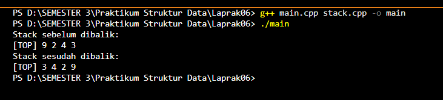
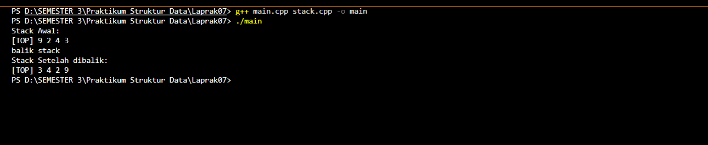
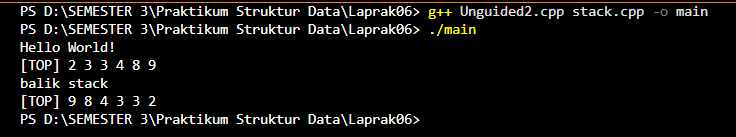
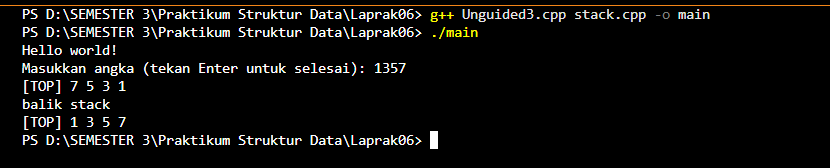

## 1. Nama, NIM, Kelas
- **Nama**: Gustaf Adiyatma Al fito 
- **NIM**: 103112400266
- **Kelas**: IF - 12 - 05

## 2. Motivasi Belajar Struktur Data
Supaya Saya bisa Struktur Data

## 3. Dasar Teori
Struktur data Stack adalah struktur linear yang menerapkan prinsip LIFO (Last In, First Out), di mana elemen terakhir yang dimasukkan akan keluar pertama. Operasi dasar stack meliputi CreateStack, push, pop, dan pengecekan kosong atau penuh. Pada programmu, fungsi pushAscending menambahkan elemen sambil menjaga urutan naik, getInputStream menerima data dari pengguna, dan printInfo menampilkan isi stack. Fungsi balikStack membalik urutan elemen dengan memanfaatkan sifat LIFO. Konsep–konsep ini penting untuk memahami cara kerja penyimpanan sementara, algoritma backtracking, rekursi, serta manipulasi data dalam pemrograman.

## 4. Guided
### 4.1 Guided 1

**-Code Program-**

```cpp
#include "stack.h"
#include <iostream>
using namespace std;

int main() {
    Stack S;
    CreateStack(S);

    
    Push(S, 3);
    Push(S, 4);
    Push(S, 8);
    Pop(S);
    Push(S, 2);
    Push(S, 3);
    Pop(S);
    Push(S, 9);

    cout << "Stack sebelum dibalik:" << endl;
    printInfo(S);

    balikStack(S);

    cout << "Stack sesudah dibalik:" << endl;
    printInfo(S);

    return 0;
}
```

**-Penjelasan Umum-**
Kode pada gambar menunjukkan program C++ yang menggunakan struktur data stack dengan operasi dasar seperti CreateStack, Push, Pop, printInfo, dan balikStack. Pada fungsi main, stack S dibuat lalu diisi dengan beberapa nilai melalui operasi Push, sementara beberapa elemen juga dihapus dengan Pop sesuai prinsip LIFO. Program menampilkan isi stack sebelum dibalik, kemudian memanggil balikStack(S) untuk membalik seluruh urutannya. Setelah proses pembalikan selesai, program kembali mencetak isi stack sehingga perbedaan sebelum dan sesudah pembalikan terlihat jelas.


### 4.2 Stack.cpp

**-Code Program-**
```cpp
#include "stack.h"
#include <iostream>
using namespace std;

void CreateStack(Stack &S) {
    S.TOP = Nil; 
}

bool IsEmpty(Stack S) {
    return S.TOP == Nil;
}

bool IsFull(Stack S) {
    return S.TOP == MaxEl - 1;
}


void Push(Stack &S, infotype X) {
    if (!IsFull(S)) { 
        if (IsEmpty(S)) {
            S.TOP = 0; 
        } else {
            S.TOP++;
        }
        S.info[S.TOP] = X; 
    } else {
        cout << "Stack penuh" << endl;
    }
}

infotype Pop(Stack &S) {
    infotype X = -999; 
    if (!IsEmpty(S)) {
        X = S.info[S.TOP];
        S.TOP--;
        if (S.TOP < 0) {
            S.TOP = Nil; 
        }
    } else {
        cout << "Stack kosong" << endl;
    }
    return X;
}

void printInfo(Stack S) {
    if (IsEmpty(S)) {
        cout << "Stack kosong" << endl;
    } else {
        cout << "[TOP] ";
        for (int i = S.TOP; i >= 0; i--) {
            cout << S.info[i] << " ";
        }
        cout << endl;
    }
}

void balikStack(Stack &S) {
    if (!IsEmpty(S)) {
        Stack temp;
        CreateStack(temp);
        while (!IsEmpty(S)) {
            Push(temp, Pop(S));
        }
        S = temp;
    }
}

void pushAscending(Stack &S, infotype X) {
    if (IsFull(S)) {
        cout << "Stack penuh" << endl;
        return;
    }

    Stack temp;
    CreateStack(temp);

    while (!IsEmpty(S) && S.info[S.TOP] < X) {
        Push(temp, Pop(S));
    }

    Push(S, X);

    while (!IsEmpty(temp)) {
        Push(S, Pop(temp));
    }
}

void getInputStream(Stack &S) {
    cout << "Masukkan angka (tekan Enter untuk selesai): ";
    string input;
    cin >> input; 

    for (char c : input) {
        if (isdigit(c)) { 
            int value = c - '0';
            Push(S, value);
        }
    }
}
```
**-Penjelasan Umum-**
Kode tersebut membuat dan mengelola struktur data stack menggunakan array dengan operasi dasar seperti membuat stack, mengecek apakah kosong atau penuh, menambah elemen (Push), menghapus elemen (Pop), menampilkan isi stack, membalik urutan stack, serta menyisipkan angka secara ascending. Fungsi Push menaruh data di posisi teratas, sedangkan Pop mengambil data dari posisi paling atas sesuai aturan LIFO. Fungsi balikStack memindahkan isi stack ke stack sementara untuk membalik urutannya. Sementara pushAscending menjaga agar data tetap terurut naik. Fungsi getInputStream membaca angka dari satu baris input dan memasukkannya satu per satu ke dalam stack.

### 4.3 stack.h
**-Code Program-**
```cpp
#ifndef STACK_H
#define STACK_H

#define MaxEl 20
#define Nil -1

typedef int infotype;

struct Stack {
    infotype info[MaxEl]; 
    int TOP;
};

void CreateStack(Stack &S);
bool IsEmpty(Stack S);
bool IsFull(Stack S);
void Push(Stack &S, infotype X);
infotype Pop(Stack &S);
void printInfo(Stack S);

void balikStack(Stack &S); 
void pushAscending(Stack &S, infotype X);
void getInputStream(Stack &S);

#endif
```

**-Penjelasan Umum-**
File stack.h berfungsi sebagai deklarasi struktur dan fungsi‐fungsi yang digunakan untuk mengelola stack. Di dalamnya ditentukan nilai maksimum elemen stack (MaxEl = 20), nilai penanda kosong (Nil = -1), serta tipe data elemen (infotype, berupa integer). Struktur Stack menyimpan array sebagai wadah data dan variabel TOP sebagai penanda posisi elemen teratas. File ini juga mendeklarasikan berbagai operasi penting seperti membuat stack (CreateStack), mengecek kondisi kosong atau penuh, menambah data (Push), menghapus data (Pop), menampilkan isi stack, membalik urutan elemen (balikStack), menambah elemen secara terurut naik (pushAscending), serta membaca input sebagai stream angka (getInputStream). Dengan header ini, seluruh fungsi dapat digunakan di file lain tanpa perlu mendefinisikannya ulang.

**-Output-**



## 5. Unguided
### 5.1 Unguided 1

**-Code Program-**
```cpp
#include "stack.h"
#include <iostream>
using namespace std;

int main() {
    cout << "Hello World!" << endl;
    Stack S;
    CreateStack(S);

    Push(S, 3);
    Push(S, 4);
    Push(S, 8);
    Pop(S);
    Push(S, 2);
    Push(S, 3);
    Pop(S);
    Push(S, 9);

    cout << "Stack sebelum dibalik:" << endl;
    printInfo(S);

    balikStack(S);

    cout << "Stack sesudah dibalik:" << endl;
    printInfo(S);

    return 0;
}
```

**-Penjelasan Umum-**
Program ini digunakan untuk mendemonstrasikan cara kerja stack menggunakan fungsi‐fungsi yang sudah didefinisikan sebelumnya. Pertama, program membuat stack baru bernama S melalui CreateStack(S). Setelah itu, beberapa nilai dimasukkan ke dalam stack menggunakan Push, dan beberapa kali elemen teratas dihapus menggunakan Pop, sehingga isi stack berubah mengikuti prinsip LIFO. Program kemudian menampilkan isi stack sebelum dibalik menggunakan printInfo(S). Setelah itu, fungsi balikStack(S) dipanggil untuk membalik urutan seluruh elemen dalam stack. Hasilnya kembali ditampilkan sehingga terlihat perbedaan antara kondisi stack sebelum dan sesudah dibalik.

**-Output-**



### 5.2 Unguided 2
**-Code Program-**
```cpp
#include "stack.h"
#include <iostream>
using namespace std;

int main() {
    cout << "Hello World!" << endl;
    Stack S;
    CreateStack(S);
    pushAscending(S, 3);
    pushAscending(S, 4);
    pushAscending(S, 8);
    pushAscending(S, 2);
    pushAscending(S, 3);
    pushAscending(S, 9);
    printInfo(S);
    cout << "balik stack" << endl;
    balikStack(S);
    printInfo(S);
    return 0;
}
```

**-Penjelasan Umum-**
Program ini menunjukkan cara memasukkan data ke dalam stack secara terurut naik menggunakan fungsi pushAscending. Pertama, stack S dibuat kosong dengan CreateStack(S). Setiap nilai yang dimasukkan—3, 4, 8, 2, 3, dan 9—tidak langsung ditempatkan di atas, tetapi disisipkan pada posisi yang tepat sehingga isi stack selalu dalam urutan ascending. Setelah semua nilai dimasukkan, program menampilkan isi stack menggunakan printInfo(S). Selanjutnya, program memanggil balikStack(S) untuk membalik seluruh susunan elemen sehingga urutannya menjadi kebalikan dari sebelumnya. Hasil akhir kemudian dicetak kembali agar terlihat perbedaan susunannya.

**-Output-**



### 5.3 Unguided 3
**-Code Program-**
```cpp
#include "stack.h"
#include <iostream>
using namespace std;


int main()
{
    cout << "Hello world!" << endl;
    Stack S;
    CreateStack(S);
    getInputStream(S);
    printInfo(S);
    cout<<"balik stack"<<endl;
    balikStack(S);
    printInfo(S);
    return 0;
}
```

**-Penjelasan Umum-**
Program ini berfungsi untuk membaca input berupa deretan angka dari pengguna, kemudian memasukkannya ke dalam stack satu per satu menggunakan fungsi getInputStream. Pertama, stack S dibuat dalam keadaan kosong melalui CreateStack(S). Ketika program dijalankan, pengguna diminta memasukkan angka pada satu baris, dan setiap karakter angka akan langsung dimasukkan ke stack dalam urutan kemunculannya. Setelah itu, printInfo(S) menampilkan isi stack sesuai data yang masuk. Program kemudian menampilkan pesan “balik stack” dan memanggil fungsi balikStack(S) untuk membalik urutan elemen pada stack. Terakhir, isi stack setelah dibalik kembali dicetak untuk menunjukkan hasil perubahannya.

**-Output-**


## 6. Kesimpulan
Stack merupakan struktur data sederhana namun sangat penting karena bekerja dengan prinsip LIFO, sehingga cocok untuk proses yang membutuhkan pengambilan data terakhir terlebih dahulu. Dari program yang kamu buat, terlihat bagaimana operasi dasar seperti push, pop, dan pengecekan kondisi stack digunakan untuk mengatur data. Penambahan fungsi seperti pushAscending, balikStack, dan getInputStream menunjukkan bahwa stack dapat dimodifikasi sesuai kebutuhan, baik untuk menjaga urutan maupun membalik isi data. Secara keseluruhan, penggunaan stack membantu pengolahan informasi menjadi lebih teratur, efisien, dan mudah diimplementasikan dalam berbagai algoritma.

## 7. Referensi
1. https://www.programiz.com/cpp-programming/online-compiler/

2. https://www.onlinegdb.com/online_c++_compiler
