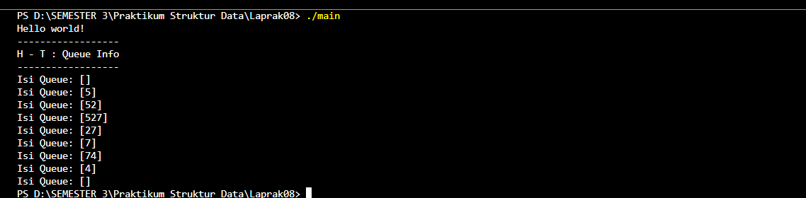
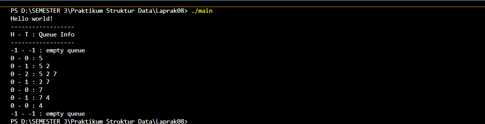
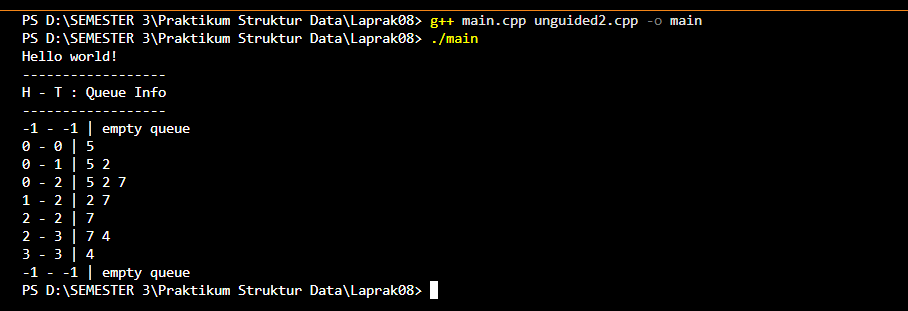
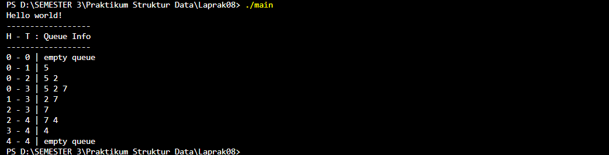

## 1. Nama, NIM, Kelas
- **Nama**: Gustaf Adiyatma Al fito 
- **NIM**: 103112400266
- **Kelas**: IF - 12 - 05

## 2. Motivasi Belajar Struktur Data
Supaya Saya bisa Struktur Data

## 3. Dasar Teori
Queue adalah struktur data linear yang bekerja dengan prinsip FIFO (First In First Out), di mana elemen yang pertama masuk akan menjadi elemen pertama yang keluar. Queue memiliki dua pointer utama, yaitu head untuk mengambil data dan tail untuk memasukkan data. Operasi utamanya meliputi enqueue untuk menambah elemen dan dequeue untuk menghapus elemen. Selain itu, terdapat operasi pemeriksaan seperti isEmpty untuk mengetahui apakah queue kosong dan isFull untuk melihat apakah kapasitas sudah penuh. Implementasi queue dapat menggunakan array statis, array linear, maupun circular queue, yang memungkinkan pemanfaatan ruang lebih efisien tanpa perlu menggeser elemen.

## 4. Guided
### 4.1 main.cpp

**-Code Program-**

```cpp
#include <iostream>
#include "queue.h"
using namespace std;

int main() {
    cout << "Hello world!" << endl; 
    
    Queue Q;
    
    cout << "------------------" << endl;
    cout << "H - T : Queue Info" << endl; 
    cout << "------------------" << endl;

    createQueue(Q); 
    printInfo(Q); 

    enqueue(Q, 5); 
    printInfo(Q);  

    enqueue(Q, 2); 
    printInfo(Q);  

    enqueue(Q, 7); 
    printInfo(Q);  

    dequeue(Q); 
    printInfo(Q); 

    dequeue(Q); 
    printInfo(Q); 

    enqueue(Q, 4); 
    printInfo(Q);  

    dequeue(Q); 
    printInfo(Q); 

    dequeue(Q); 
    printInfo(Q); 

    return 0; 
}
```

**-Penjelasan Umum-**
Program di atas adalah contoh implementasi queue menggunakan array statis. Fungsi main() menampilkan pesan awal kemudian membuat sebuah queue kosong melalui createQueue(Q). Selanjutnya, program menampilkan kondisi queue setiap kali operasi dilakukan. Operasi enqueue() menambahkan elemen ke bagian belakang queue, sedangkan dequeue() menghapus elemen dari bagian depan queue dan menggeser elemen lain agar posisi tetap teratur. Setelah setiap operasi, printInfo(Q) dipanggil untuk menampilkan nilai head, tail, serta isi queue saat ini. Dengan urutan operasi ini, program mendemonstrasikan bagaimana queue berubah secara dinamis sesuai prinsip FIFO (First In First Out).


### 4.2 Queue.cpp

**-Code Program-**
```cpp
#include "queue.h"
#include <iostream>
using namespace std;

void createQueue(Queue &Q) {
    Q.head = 0;
    Q.tail = 0;
    Q.count = 0;
}

bool isEmpty(Queue Q) {
    return Q.count == 0;
}

bool isFull(Queue Q) {
    return Q.count == MAX_QUEUE;
}

void enqueue(Queue &Q, int x) {
    if (!isFull(Q)) {
        Q.info[Q.tail] = x;
        Q.tail = (Q.tail + 1) % MAX_QUEUE;
        Q.count++;
    } else {
        cout << "Antrean Penuh!" << endl;
    }
}

int dequeue(Queue &Q) {
    if (!isEmpty(Q)) {
        int x = Q.info[Q.head];
        Q.head = (Q.head + 1) % MAX_QUEUE;
        Q.count--;
        return x;
    } else {
        cout << "Antrean Kosong!" << endl;
        return -1;
    }
}

void printInfo(Queue Q) {
    cout << "Isi Queue: [";
    if(!isEmpty (Q)){
        int i = Q.head;
        int n = 0;
        while (n < Q.count) {
            cout << Q.info[i];
            if (n < Q.count - 1) { 
                cout << ", ";
            }
            i = (i + 1) % MAX_QUEUE;
            n++;
        }
    }
    cout << "]" << endl;
}
```
**-Penjelasan Umum-**
Kode di atas mengimplementasikan struktur data Queue (Antrian) menggunakan array dengan pendekatan sirkular (circular). Dalam implementasi ini, antrian menggunakan empat variabel kunci: info (array untuk menyimpan data), head (indeks elemen pertama/depan), tail (indeks tempat elemen baru akan dimasukkan), dan count (jumlah elemen saat ini). Pendekatan sirkular memastikan pemanfaatan ruang array yang efisien; ketika tail atau head mencapai akhir array, ia akan melingkar kembali ke indeks 0, mencegah fenomena "Antrian Penuh Semu". Fungsi enqueue menambahkan elemen di tail dan memajukan tail secara sirkular, sementara dequeue menghapus elemen dari head dan memajukan head secara sirkular. Variabel count adalah cara yang andal untuk menentukan apakah antrian kosong.

**-Output-**

### 4.3 Queue.h
**-Code Program-**
```cpp
#ifndef QUEUE_H
#define QUEUE_H

#include <iostream>
using namespace std;

#define MAX_QUEUE 5 
typedef int infotype;

struct Queue {
    infotype info[MAX_QUEUE]; 
    int head;
    int tail;
    int count;
};

void createQueue(Queue &Q);
bool isEmptyQueue(Queue Q);
bool isFullQueue(Queue Q);
void enqueue(Queue &Q, infotype x);
infotype dequeue(Queue &Q);
void printInfo(Queue Q);

#endif
```

**-Penjelasan Umum-**
Header file queue.h mendefinisikan struktur dan operasi dasar untuk mengelola queue berbasis array statis berukuran tetap. Struktur Queue memiliki tiga atribut utama: head sebagai indeks elemen depan, tail sebagai indeks elemen belakang, serta count untuk menghitung jumlah elemen saat ini. Array info digunakan untuk menyimpan data dengan batas maksimal MAX_QUEUE. File ini juga mendeklarasikan beberapa fungsi penting seperti createQueue untuk inisialisasi, isEmptyQueue dan isFullQueue untuk memeriksa kondisi queue, enqueue untuk menambah elemen, dequeue untuk menghapus elemen, serta printInfo untuk menampilkan isi queue. Ini menjadi blueprint operasi queue di program utama.

**-Output-**



## 5. Unguided
### 5.1 Unguided 1

**-Code Program-**
```cpp
#include <iostream>
#include "queue.h"

void createQueue(Queue &Q) {
    Q.head = -1;
    Q.tail = -1;
}

bool isEmptyQueue(Queue Q) {
    return Q.tail == -1;
}

bool isFullQueue(Queue Q) {
    return Q.tail == MAX_QUEUE - 1;
}

void enqueue(Queue &Q, infotype x) {
    if (isFullQueue(Q)) {
        cout << "Antrean Penuh!" << endl;
    } else {
        if (isEmptyQueue(Q)) {
            Q.head = 0; 
        }
        Q.tail++;
        Q.info[Q.tail] = x;
    }
}

infotype dequeue(Queue &Q) {
    if (isEmptyQueue(Q)) {
        cout << "Antrean Kosong!" << endl;
        return -1;
    } else {
        infotype x = Q.info[Q.head];
        for (int i = Q.head; i < Q.tail; i++) {
            Q.info[i] = Q.info[i + 1];
        }
        Q.tail--;
        if (Q.tail == -1) { 
            Q.head = -1;    
        }
        return x; 
    }
}

void printInfo(Queue Q) {
    cout << Q.head << " - " << Q.tail << " : "; 
    if (isEmptyQueue(Q)) {
        cout << "empty queue" << endl; 
    } else {
        for (int i = Q.head; i <= Q.tail; i++) {
            cout << Q.info[i];
            if (i < Q.tail) {
                cout << " ";
            }
        }
        cout << endl;
    }
}
```

**-Penjelasan Umum-**
Kode ini berisi implementasi lengkap dari operasi queue berbasis array statis. Fungsi createQueue menginisialisasi queue dengan nilai head dan tail -1 sebagai tanda kosong. isEmptyQueue dan isFullQueue digunakan untuk memeriksa apakah queue sedang kosong atau penuh. Operasi enqueue menambahkan elemen baru di posisi tail dan menangani kondisi ketika queue masih kosong. Sebaliknya, dequeue menghapus elemen pertama dengan menggeser seluruh isi array satu langkah ke kiri, kemudian menurunkan nilai tail. Jika elemen terakhir dihapus, sistem mengatur queue kembali kosong. Fungsi printInfo menampilkan posisi head–tail serta isi queue secara berurutan.

**-Output-**



### 5.2 Unguided 2
**-Code Program-**
```cpp
#include <iostream>
#include "queue.h"

void createQueue(Queue &Q) {
    Q.head = -1;
    Q.tail = -1;
}

bool isEmptyQueue(Queue Q) {
    return Q.tail == -1 || Q.head > Q.tail;
}

bool isFullQueue(Queue Q) {
    return Q.tail == MAX_QUEUE - 1;
}

void enqueue(Queue &Q, infotype x) {
    if (isFullQueue(Q)) {
        cout << "Antrean Penuh (Penuh Semu)!" << endl;
    } else {
        if (isEmptyQueue(Q)) {
            Q.head = 0; 
        }
        Q.tail++;
        Q.info[Q.tail] = x;
    }
}

infotype dequeue(Queue &Q) {
    if (isEmptyQueue(Q)) {
        cout << "Antrean Kosong!" << endl;
        return -1;
    } else {
        infotype x = Q.info[Q.head];
        
        Q.head++; 
        
        if (Q.head > Q.tail) { 
            Q.head = -1;       
            Q.tail = -1;
        }
        return x;
    }
}

void printInfo(Queue Q) {
    cout << Q.head << " - " << Q.tail << " | ";
    if (isEmptyQueue(Q)) {
        cout << "empty queue" << endl;
    } else {
        for (int i = Q.head; i <= Q.tail; i++) {
            cout << Q.info[i] << " ";
        }
        cout << endl;
    }
}
```

**-Penjelasan Umum-**
Kode ini mengimplementasikan queue linear berbasis array yang lebih efisien karena tidak lagi melakukan shifting saat elemen di‐dequeue. Fungsi createQueue mengatur awal queue dalam keadaan kosong, sedangkan isEmptyQueue memeriksa dua kondisi: tail = -1 atau head melewati tail. Fungsi isFullQueue mengecek apakah tail sudah mencapai batas array. Operasi enqueue menambah elemen di posisi tail, dan jika queue kosong, head diinisialisasi ke 0. Operasi dequeue cukup menaikkan nilai head tanpa menggeser elemen, menjadikannya lebih cepat. Ketika head melewati tail, queue direset kembali. Fungsi printInfo menampilkan posisi head–tail dan isi queue.

**-Output-**



### 5.3 Unguided 3
**-Code Program-**
```cpp
#include <iostream>
#include "queue.h"

void createQueue(Queue &Q) {
    Q.head = 0;
    Q.tail = 0;
}

bool isEmptyQueue(Queue Q) {
    return Q.head == Q.tail;
}

bool isFullQueue(Queue Q) {
    return (Q.tail + 1) % MAX_QUEUE == Q.head;
}

void enqueue(Queue &Q, infotype x) {
    if (isFullQueue(Q)) {
        cout << "Antrean Penuh!" << endl;
    } else {
        Q.info[Q.tail] = x;
        Q.tail = (Q.tail + 1) % MAX_QUEUE;
    }
}

infotype dequeue(Queue &Q) {
    if (isEmptyQueue(Q)) {
        cout << "Antrean Kosong!" << endl;
        return -1;
    } else {
        infotype x = Q.info[Q.head];
        Q.head = (Q.head + 1) % MAX_QUEUE; 
        return x;
    }
}

void printInfo(Queue Q) {
    cout << Q.head << " - " << Q.tail << " | "; 
    if (isEmptyQueue(Q)) {
        cout << "empty queue" << endl;
    } else {
        int i = Q.head;
        while (i != Q.tail) {
            cout << Q.info[i] << " ";
            i = (i + 1) % MAX_QUEUE; 
        }
        cout << endl;
    }
}
```

**-Penjelasan Umum-**
Kode ini mengimplementasikan circular queue menggunakan array, sehingga ruang dapat digunakan kembali tanpa perlu shifting data. Queue diinisialisasi dengan head dan tail bernilai 0, menandakan posisi awal. Fungsi isEmptyQueue menentukan queue kosong ketika head dan tail sama, sedangkan isFullQueue memeriksa apakah indeks tail yang berikutnya akan bertemu head, menandakan penuh. Pada enqueue, elemen baru disimpan pada posisi tail dan indeks tail digeser melingkar menggunakan operasi modulo. Sebaliknya, dequeue mengambil elemen pada head lalu memajukan indeks head. Fungsi printInfo menampilkan seluruh isi queue dengan iterasi melingkar hingga mencapai posisi tail.
**-Output-**


## 6. Kesimpulan
perkembangan dari struktur data sederhana menuju bentuk yang lebih efisien. Dimulai dari queue statis yang masih melakukan shifting pada operasi dequeue, kemudian diperbaiki menjadi queue linear yang hanya menggeser indeks, hingga akhirnya mencapai circular queue yang mampu memanfaatkan ruang array secara optimal tanpa pemborosan memori. Setiap versi tetap mengikuti prinsip dasar FIFO dan menggunakan operasi inti seperti enqueue, dequeue, isEmpty, dan isFull. Melalui ketiga pendekatan ini, terlihat bagaimana desain queue dapat disesuaikan untuk meningkatkan efisiensi waktu dan ruang dalam pemrosesan data.

## 7. Referensi
1. https://www.programiz.com/cpp-programming/online-compiler/

2. https://www.onlinegdb.com/online_c++_compiler
